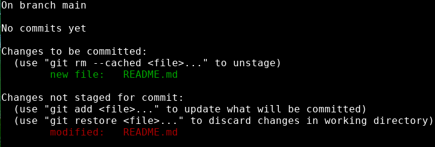

# Git add

---


Now that we have a file in our project, let's start tracking it with Git. We can do this with the add command:

The add command takes this format:
```bash
git add <filename>
```
Let's use it to start tracking the README file we made:

```bash
git add README.md
```

Now what does `git status` tell us?


{: .terminal }

Git is now actively watching our README.md file for changes. 

We could commit right now to permanently save our changes to the repository history. This would mean that anytime we wanted, we could have Git take us back to this moment in the development of our project. 

I'm going to add another line to the file and see what Git has to say about it. 

```bash
A website for showcasing my skills.
```
We know that git was tracking README.md for changes, so it should have noticed that the file changed. 

Let's run `git status` again and see if it did:


{: .terminal}

Yet another informative message from Git. This is why you should run git status before you do anything else with the Git repository. 

In this message, Git is telling us a few things:
* the old version of README.md can be committed now
* the new version (with the extra line) would not be committed if we made a commit right now
* we could also throw away our new changes by using ```git restore <filename>```

Right now, we have access to 2 versions of README.md:
1. The version we ran ```git add``` on just a moment ago, with just one line of code
2. The version that exists in our directory now, with 2 lines of code

If we want to save the newest version of README.md to the index, we just add the file again:
```bash
git add README.md 
```

---
> Often, we will just want to back up everything we've worked on in the directory. Instead of adding each file individually, we can just add all files with:
> ```bash
> git add .
> ```
> or:
> ```bash
> git add -A
> ```
{: .pro-tip }

---

> ## Exercise
> - [ ] Start tracking your README file by running `git add README.md`
> - [ ] Run `git status` to make sure your file is being tracked
> - [ ] Make a change to your file and run `git status` again
> - [ ] Try running `git restore README.md`, then look at the content of your README file
> - [ ] Add a line to your README.md, run `git add README.md` and run `git status` again
{: .exercise}
