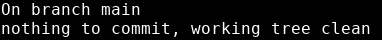

# Git commit
---


Now that we've added a file for git to track, we can make our first commit. 
```bash
git commit -m "first commit, added README.md"
```

Notice the -m option. This stands for __message__. 

Any time we make a commit, we want to give it a descriptive message that tells us whatever new changes have been made since the last time we committed. 

But what is a commit anyway?

If you remember from earlier, commits are like breadcrumbs. So now we have one breadcrumb on our trail. This means that any time we want, we can come back to this version of our project.

This is why descriptive commit messages are important. If we find ourselves trying to figure out where our program went wrong, we need to know what changes happened at each breadcrumb we could go back to.

Let's run our favorite command again:

```bash
git status
```


{: .terminal}

Now our changes have been immortalized in a commit.

---
# Adding vs Committing
---

Adding and committing are different. 

When we *add* a file, we are placing it in the __staging area__.

When we *commit*, we are adding everything in the staging area to the __repository history__.
<br>


{: .text-center}

We can add to the __staging area__ as many times as we want before committing. 

You can think of the staging area as a middle ground. Files in the staging area aren't permanent features of the repo, but they give us a state to fall back to if we are in between commits.

This is what we were doing when we ran `git restore` in the last exercise. We were taking the version of our file in the staging area and overwriting the version in our working directory.

We can revisit any of our old commits, no matter how far along we get in our project.

There is no way to revisit the state of the staging area later. Only __commits__ can be revisited.

---
> ## Exercise:
> ---
> 
> - [ ] Create a file called index.html in your repository
> - [ ] Copy the code below and paste it into index.html
> - [ ] Add index.html to your staging area
> - [ ] Make a commit with a descriptive message 
> - [ ] `git commit -m "<my descriptive commit message>"`
> 
> ```html
> <html lang="en">
> <head>
>     <meta charset="UTF-8">
>     <meta http-equiv="X-UA-Compatible" content="IE=edge">
>     <meta name="viewport" content="width=device-width, initial-scale=1.0">
> 		<link rel="stylesheet" href="style.css"></link>
>     <title>Your Name Here</title>
> </head>
> <body>
> 
> <div id="header"><h1>Your Name Here</h1></div>
> 
> <div id="skills" class="section">
>   <h2>-My Skills-</h2>
>   <ul>
>     <li></li>
>   </ul>
> </div>
>     
> </body>
> </html>
> ```
{: .exercise}
