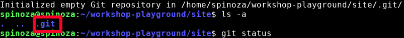

# Git init
---

First, let's start a git project in our directory.
open a terminal and type:

```bash
git init
```

So, what did this just do? 

When you run git init, you are setting up a git repository. This means that git is setting up any structures it needs to track your work, and placing them in a special folder called .git. Let's take a look at the contents of our directory now by executing `ls -a`:


{: .terminal }

There it is! Our git repository is being maintained in the .git folder. 

---
> .git is a **hidden** folder, so it won't show up in your file system unless you reveal hidden files. We won't be modifying the folder anyway, but it's good to know it is there. 
{: .note}

Running ```git init``` should be one of the first steps you take when starting any software development project.

Since our repository was started in this directory, Git will track any files we tell it about in this directory or any subdirectories we create inside this one. 

Aside from listing the directory contents, there are some other ways we can find out what is going on with our Git repository...

---
> ## Exercise
> - [ ] create a new directory for your project
> - [ ] inside this directory, run ```git init```
> - [ ] make sure your terminal says it has initialized a Git repository
{: .exercise}
