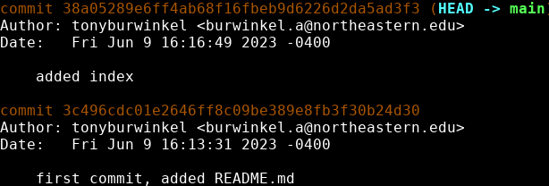

# Git log

---
Now that we have made a few commits, we should take a look at the history of our repository. Git has another command for this:

```bash
git log
```
This command shows us a few things:
- **Commit Hash**: A unique identifier for each commit.
- **Author**: The name and email of the person who made the commit.
- **Date**: The date and time the commit was made.
- **Commit Message**: A description of the changes made in the commit.

Commit hashes are important because they let us revisit old commits.


{: .terminal}

Git log uses a pager to display our commit history, so you can use your up and down arrow keys to move up and down once the history gets long. 

Git log also has some useful options we can use to make our history easier to look at:

```bash
git log --oneline
```


{: .terminal}

When you've got a lot of commits and are looking for one in particular, the ```--oneline``` option comes in handy. 

You'll notice the commits in this version of the log have short hashes. These can also be used to go back to a commit.

---

> ## Exercise
> - [ ] Now that you have a few commits, run `git log` to look at them
> - [ ] Try `git log --oneline` to shorten the output
> - [ ] Now try `git log --stat` to view the changes made in each commit
{: .exercise}
