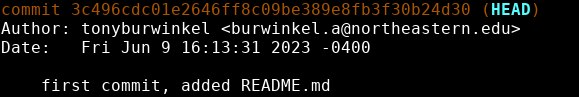

# Git's HEAD
---

Where's your HEAD at?


{: .terminal}

When we run git log, we can see that HEAD is pointing to main.

But what is HEAD?


{: .text-center}

HEAD is just a pointer to where we are in our repository history. Think of it as the  "You Are Here" pin on a map. 

Whenever we use git log, it shows us the history of our repository and __where we are__ relative to that history. Right now, our HEAD is pointing to the second commit in the repository, our most recent commit. 

This is typically the case. Since we are usually adding to our most recent changes, HEAD will point to the latest commit. 

Whatever HEAD is pointing to is what will be shown in your working directory.

I can use ```git checkout 3c496cd``` to go back in time to an older commit.

```bash
git checkout [commit-hash]
```

In the above command, we use the commit hash of our first commit to place HEAD. We need to provide at least the first 4 characters to specify the commit hash we want to move to.

If we run ```git log```:



 When we checkout a commit, git sets up our working directory to be exactly as it was when we made that commit. If you look at the files in your directory, you'll notice index.html is missing.

If I want to go back, I can run ```git checkout``` with a branch name instead:

```bash
git checkout main
```


Now we are back to the current state of our project.

We can also use ```git checkout <HEAD~position>``` to move to a commit relative to where we are now. So if I wanted to go back to the commit before this one:

```bash
git checkout HEAD~1
```

---
> ## Exercise:
> 
> - [ ] Use ```git checkout``` with your last commit's hash to go back in time
> 	* you will need to get the commit's hash using ```git log```
> 	* you can paste from the clipboard into the terminal by using ```Ctrl+Shift+V```
> - [ ] Use ```git checkout main``` to return to the most recent commit
> - [ ] Use ```git checkout HEAD~1``` to go back one commit
{: .exercise}


