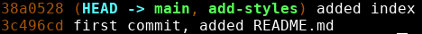
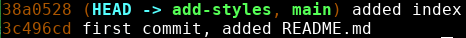
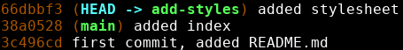

# Git branch
---
So we have a simple website set up. 

Now we want to continue developing it, but we want to avoid messing up the work we have already done.

Git can help us with this. To keep our main branch separated from any changes we are about to make, we should create a new __branch__.

Let's add some very simple styling to our website. 

First, let's make a new branch by running this command:

```bash
git branch add-styles
```

Notice the form of the git branch command is ```git branch <new-branchname>```. Our new branch name can't contain any spaces, and should give some idea of what kind of changes we are thinking about implementing on the branch. We can list out all of our currently available branches with this command:

```bash
git branch
```

{: .terminal}

We see that we now have 2 branches: our original 'main' and our new one called 'add-styles'.

Let's now run ```git log --oneline``` again to see what's going on with git:


{: .terminal}

There's our new branch, add-styles, right next to main.

We can see that HEAD is pointing to main right now. This means that we have created our new branch, but we still need to __switch__ to it.

We can switch to our new branch by using this command:

```bash
git switch add-styles
```

If we run ```git log --oneline``` again, we can see that HEAD is now pointing to the new branch, add-styles:


{: .terminal}

 This means that any changes we make will be recorded on the add-styles branch, while our main branch is untouched.

---
> ## Exercise
> ---
> 
>  Let's do some work on this branch and see what happens with git. 
> 
>  - [ ] create a new branch called add-styles
>  - [ ] switch to your new branch
>  - [ ] create a file called style.css and copy the code below into it
> - [ ] add style.css to the staging area and commit it:
> 
> ```css
> * {
> 	box-sizing: border-box;
> 	padding: 0;
> 	margin: 0;
> 	font-family: monospace;
> }
> 
> body {
> 	background-color: aliceblue;
> }
> 
> #header {
> 	background-color: lightblue;
> 	padding: 10px;
> 	border-bottom: 1px solid black;
> }
> ```
> 
{: .exercise}
---


Now let's see what ```git log --oneline``` has to say:


{: .terminal}

HEAD is still pointing to the add-styles branch. This means that the changes we made won't be reflected in main. We are now one commit "ahead" of main. 

---
## Integration vs. Feature Branches
---

Almost all software development projects have this kind of structure. There is one branch where all the final changes get put together-- that's main. This is usually referred to as the __integration branch__. 

Then there are branches that software developers are currently working on, but aren't ready to be integrated into main. These are referred to as __feature branches__. Our repository now has one feature branch-- add styles. But we can make as many feature branches as we want, and we should! This is one of the most useful features of git. 

Any time we are going to make changes or implement a new feature, we should make a branch from the main integration branch. That way, if we don't like our changes, or discover they won't work, we still have a working copy of our software from before we decided to tinker with it.

> We can make a new branch and switch to it with just one command, instead of two:
> ```bash
> git checkout -b <new-branchname>
> ```
{: .pro-tip}
