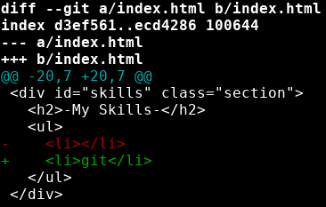
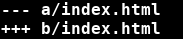
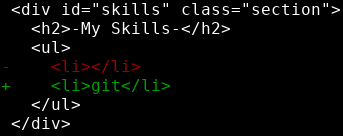

# Git diff
---

I'm going to make another branch for adding some skills to my website.

```bash
git checkout -b add-skills
```

Now I'll add `git` to my skills section in the index.html file. That section should now look like this:

index.html:
```html
...
<div id="skills" class="section">
  <h2>-My Skills-</h2>
  <ul>
    <li>git</li>
  </ul>
</div>
...
```

Now I'll add my changes to the staging area using `git add .`

Now let's try another handy git command, `git diff`. 

To use git diff, we use the command format `git diff <target branch>` 

This compares the branch we are currently on to the target branch. If we want to see the differences between main and our current branch, add-skills, we should run:

```bash
git diff main
```


{: .terminal}

Git gives us a lot to look at here. 

Line 1:


* this tells us the file that is different on the 2 branches
* `a` is always the target branch, in this case, it's `main`
* `b` is the branch we are on, in this case, it's `add-skills`
* We view changes from the perspective of the target, `a`. That is, deviations from the target are displayed (think 'A/B testing' -- `a` is old and `b` is new)

Lines 3-4: 


* these lines tell us how to interpret line 5
* branch `a` (main) will be led with '-'
* branch `b` (add-skills) will be led with '+'

Line 5:


* This line tells us the displayed lines for each version
* `-l,s` indicates the starting line `l` (inclusive) and the number of lines beyond that `s` (exclusive) for version `a`
* `+l,s` indicates the starting line `l` (inclusive) and the number of lines beyond that `s` (exclusive) for version `b`
* We modified a single line, so the affected lines are the same: `-20,7` and `+20,7`. If we'd instead appended, deleted, or inserted a line, these values would differ.

Lines 6-12



* These lines display the change made, as well as preceding and and subsequent lines for context
* <span style="color:green;">+ indicates what was added in version b</span> 
* <span style="color:red;">- indicates what was deleted in version b</span> 
* A modification to a line is considered to be a deletion of the entire line and then an addition to that same line, as we see here

You can also run `git diff` without specifying another branch or commit hash, and this will display the difference between your current changes and the most recent changes added to the staging area.

---
> ## Exercise
> - [ ] create a new branch from main called add-skills
> - [ ] switch to the new branch and add to your skills in index.html
> - [ ] use git diff to compare your new branch to main using 
> - [ ] commit your changes and switch back to main
> - [ ] merge your changes into the main branch using `git merge`
{: .exercise}
