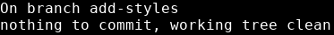
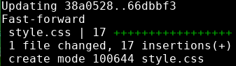
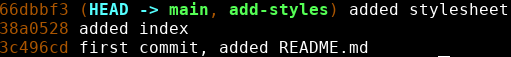
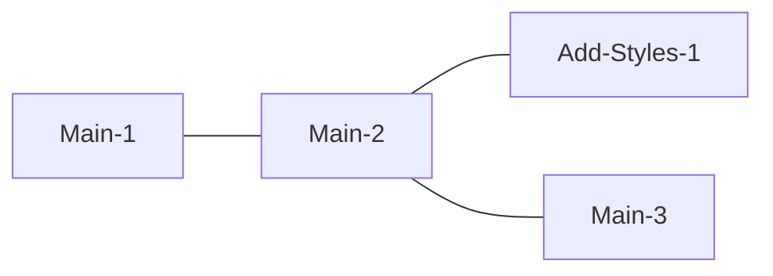
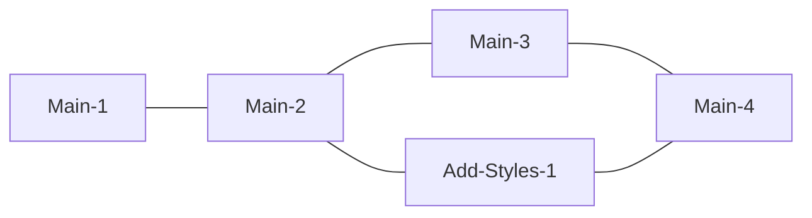

# Git merge
---

Once we're happy with the work we've done on our feature branch, the next thing we want to do is __integrate__ it into the main branch. Git has a special command for this called __merge__.

Merging is taking all the file contents of one directory and adding them to another. Git can do this for us automatically with the ```git merge``` command. 

This saves us a lot of work. Without the merge command, we would be forced to look through every line in our files, adding line by line any changes we made since the last time we saved.

Before we merge, we should do a few things:
* Run ```git status``` to make sure our changes are committed
* Commit any outstanding changes on the feature branch
* Switch to the branch we want to merge into

Running ```git status```:


{: .terminal}

Looks like all of our work is committed. 

---
## Ready to merge...
---

Let's switch back to our main branch:
```bash
git switch main
```

Now let's run the merge command. The syntax for the merge command is ```git merge <target-branch>```. Running this brings any changes from the target-branch into the branch we are on now. Let's try it:

```bash
git merge add-styles
```


{: .terminal}

Okay great, seems like it worked. 

Let's take a look at ```git log --oneline``` again.


{: .terminal}

Now HEAD is pointing at main again. This means we are on the main branch. We can see that now add-styles is on the same line as main. Main and add-styles are on the same commit, which is to say, their contents are identical now. 

---
## Delete Your Branches
---

This may seem strange, but the best thing to do now is to delete our feature branch. Don't worry, this won't remove anything important, and is considered a best practice. 

To delete a branch, we use the ```git branch``` command with the ```-d``` option. The format for the command is ```git branch -d <target-branchname>```

Let's try it on our add-styles branch:

```bash
git branch -d add-styles
```
When we run the command, git gives us a little info:


{: .terminal}

Note that the hash provided is the same as our current commit hash. 

This is because branches aren't really structural features in git. Branches are just labels for the last commit on a certain path in the git graph, kind of like HEAD is just a label for the commit we currently have checked out. All git is telling us here is that it has removed the label from our current commit. Once we merged them, both branches, main and add-styles, were pointing to the same commit. Now only the main pointer remains, but nothing has materially changed.

---
## Git is a graph
---

Every commit you make is a __node__ in this graph.


{: .text-center}


If we had made any commits on main before merging with the add-styles branch, our graph would have looked like this before merging:


{: .text-center}


After merging, our Git history would look like this:


{: .text-center}

This is typically how Git histories look. Feature branches branch off from the main integration branch, and then lead back into it when they are merged.

---
> ## Exercise
> - [ ] From your add-styles branch, add and commit any unsaved changes
> - [ ] Run `git status` to make sure your working tree is clean
> - [ ] switch back to your main branch using `git switch main`
> - [ ] Merge your add-styles branch into main by running `git merge add-styles`
> - [ ] Run `git log --oneline` to see that the branches have merged
>     * you should see that main and add-styles both appear on the same line
>     * HEAD should point to main
{: .exercise}

