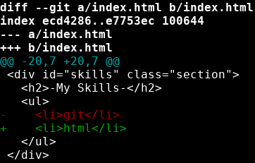
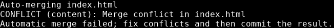
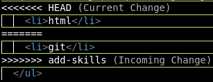
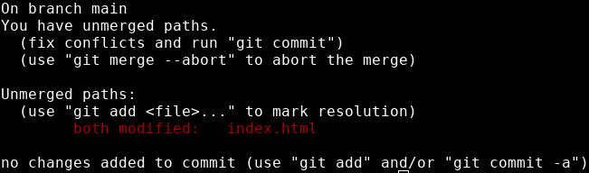
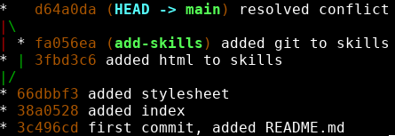

# Resolving Merge Conflicts
---

Git is pretty good about deciding what to do when merging branches. 

Sometimes we have to step in and make some manual changes before a merge can happen. 

I'm going to set up a situation where there is a merge conflict and show you how to resolve it.

Right now, my add-skills branch has one skill: git.

I'm going to switch back to main, but instead of merging, I'm going to add to the same line of index.html and commit my changes. When I run `git diff add-skills`:


{: .terminal}

We can see that the two lines are different.

When I try to merge the branches:


{: .terminal}

If we look in the file that git is complaining about, it has inserted some edits:


{: .terminal}

These are the lines we saw when we ran git diff. 

There are a few ways to resolve the conflict:
* edit the files themselves
* choose one file as the correct one

I'm going to accept one file as the correct version. To do this, I'll enter the command:

```bash
git checkout --theirs index.html
```
This will put the index.html file from add-styles into my directory. 

I can switch back and forth between the two versions using the same command. If I wanted to use the version of index.html from the branch I'm on, I could use:

```bash
git checkout --ours index.html
```

Once I have the file I want to go with checked out, I can add it to the staging area and commit it to resolve the conflict.

Running git status confirms this:


{: .terminal}

I'll just add index.html to the staging area and commit, and the merge is complete!

---

Merge conflicts are a common part of collaborative software development. Knowing why they happen and what to do about it is important! Just remember:

* merge conflicts happen when we try to merge 2 divergent branches
* branches are divergent when they have a file with 2 completely different things on one line
* we can resolve conflicts by editing the files on both branches to make them the same
* we can resolve conflicts by just choosing one file to go with

## Visualizing Merges

To see what just happened, we can use another one of git log's options: --graph.

If I run ```git log --oneline --graph```:


{: .terminal}

---
