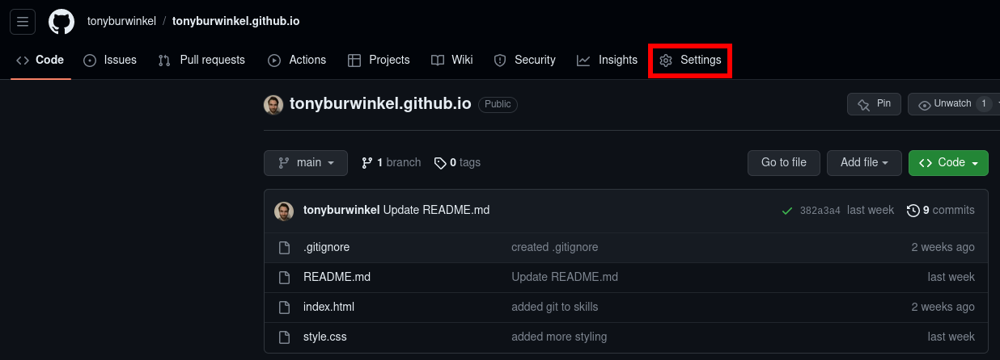
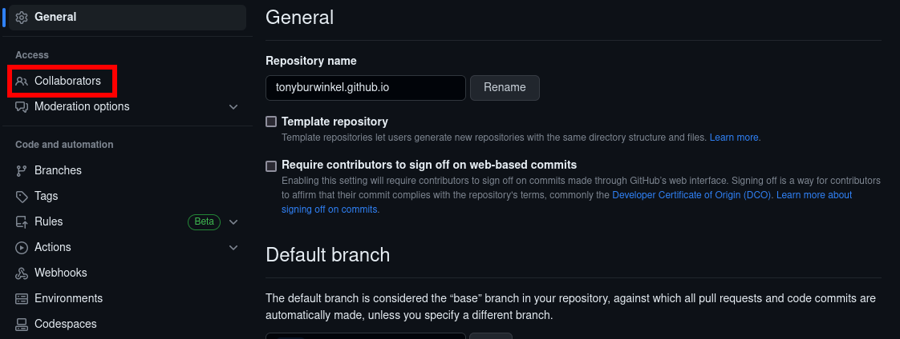
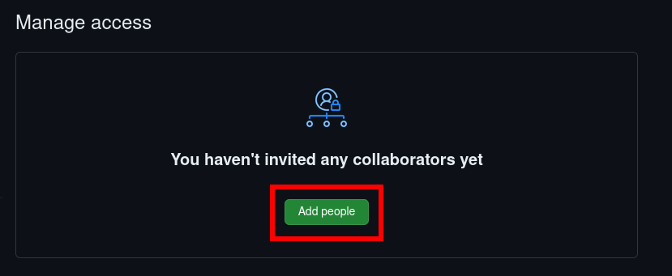
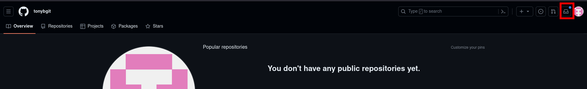
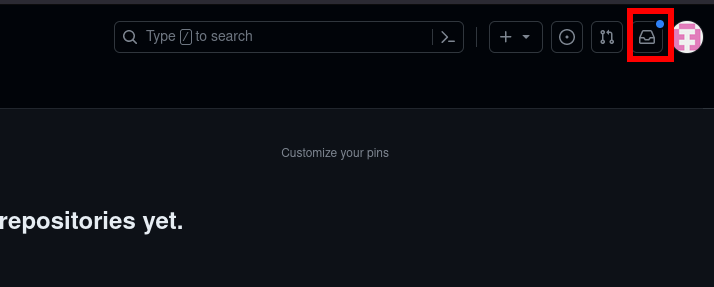
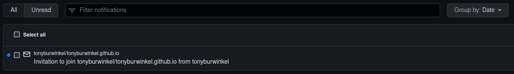

# Adding collaborators to your repo

---
## Repository Owner Steps:
---

Now that we have our website repository set up and pushed to GitHub, it's time to invite some collaborators.

Anyone you add as a collaborator to your project will have the ability to push their changes to your repository.

Go to your repository page on GitHub and click the settings tab:

In the left hand menu, click Collaborators:

Click add people and search for the GitHub username of your teammate:

---
## Collaborator Steps:
---

Your teammate will receive a message in their GitHub inbox.

Your GitHub inbox can be accessed in the upper right corner of your profile:

Once you accept the invitation, you will be taken to the repository page and notified that you now have push rights to the repository:

This means that you can push to and pull from this repository as if it were your own.

---
> ## Exercise
> 
> - [ ] log into your GitHub account
> - [ ] give me your GitHub username
> - [ ] accept my invitation to collaborate
{: .exercise}
