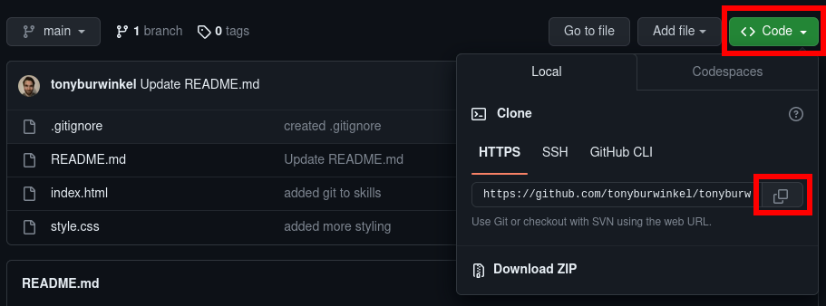
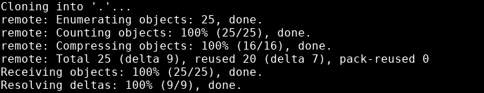

# Git clone
---

Now that you have access rights to the remote repository, you need to get it onto your local machine.

In order to do this, you need to __clone__ the repository.

Cloning a repository will create an identical copy of the repository on your machine.

To clone the repo, you'll need the link from the repository Code dropdown:



Once you have the link copied, go to your command line and use the `git clone` command with the link:

```
git clone <link>
```


{: .terminal}

Your local copy will already have a remote origin set.

Any changes you make to the main branch, you can push to the remote, so long as your branch is up to date with origin/main

---
> ## Exercise
> 
> - [ ] clone my github repository to your machine
> - [ ] add your name to the collaborators section of README.md
> - [ ] run git pull to make sure you are up to date with the main branch
> - [ ] add and commit your changes to README.md
> - [ ] push to the main branch
{: .exercise}