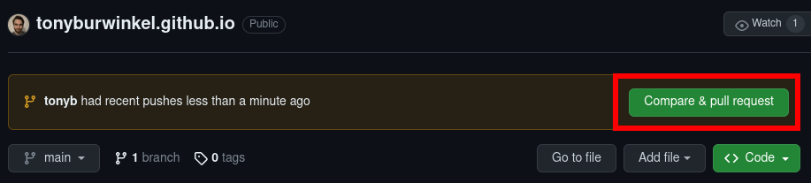
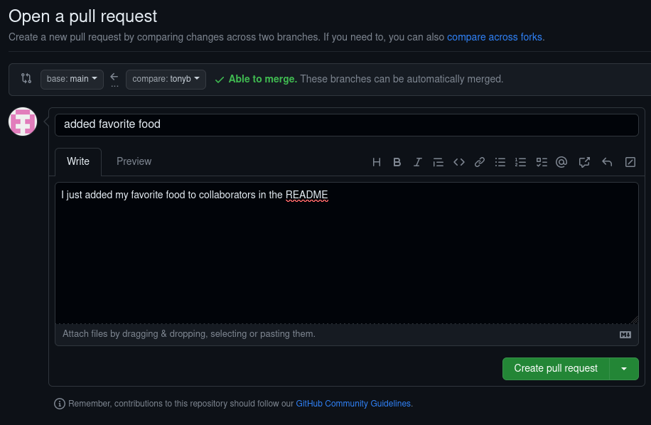
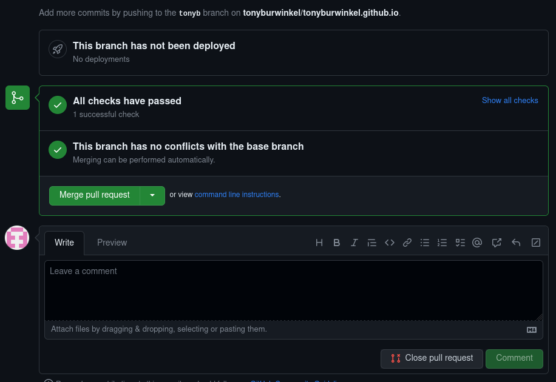
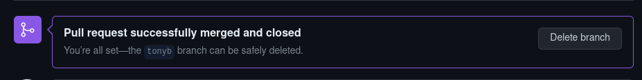
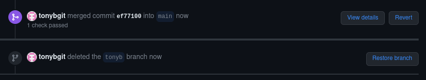

# Pull Requests
---

Once you have made your changes and pushed them to the remote tracking branch, they will show up on GitHub:

With local branches, once we were finished making changes, we __merged__ back into main using `git merge`

When we use a remote tracking branch, we can do the same thing by creating a __pull request__.

We can add more description to our commit for the repository owner to see. 

Then we can create a pull request by clicking the green button.

---

In some scenarios, the owner of the repository will want to look over our changes before merging the pull request.

In this case, we have push access to the repository, so we can perform the merge ourselves:

Git lets us know that there are no conflicts with the main branch, so we can automatically merge them, just like we did with our local branches.

Once we merge the pull request, just as with our local branches, we will want to delete the branch.

GitHub's interface allows us to delete the branch with the click of a button:

We should go ahead and do this, since it is a Git best practice. 

Then we can delete the local branch by switching back to main and running `git branch -d <branchname>`

---
> ## Exercise
> - [ ] visit the repository you cloned on GitHub
> - [ ] go to your branch and create a pull request
> - [ ] merge your pull request with main
> - [ ] delete your tracking branch on GitHub
> - [ ] delete your local branch using Git
{: .exercise}