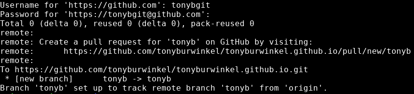
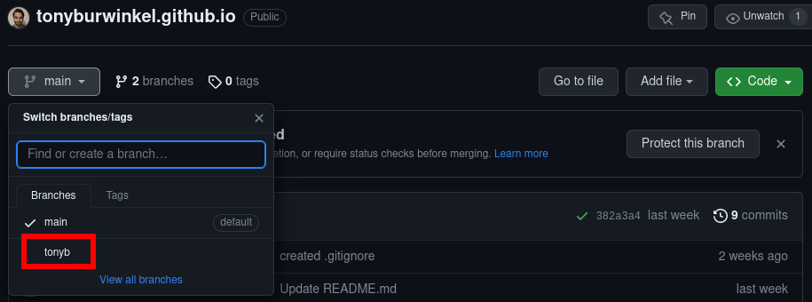

# Making Remote Branches
---

You may have had trouble adding your changes to origin/main in the last exercise.

If another collaborator managed to push their changes after you cloned the repository, your local copy fell behind origin/main

The solution to this problem is __remote branches__.

Whenever we make changes to our existing local code base, we want to make a branch first, then make some changes, then merge back into main.

How can we do this with a remote repository?

First, I'll create a new local branch and switch to it:

```bash
git checkout -b tonyb
```

We can make a remote tracking branch at the origin (the original repository on GitHub) by using push with the --set-upstream option:

```bash
git push --set-upstream origin tonyb
```

If all goes well, we should see this in the command line: 



Once we run this, a new branch will be created in the GitHub remote:



Now we can use this upstream branch to add features to the code base without worrying about being up to date with the main branch.

All commits we make and push will live in this remote tracking branch.

---
> ## Exercise:
> 
> - [ ] create your own local branch in your cloned repository and switch to it
> - [ ] create a remote tracking branch for this new branch on the GitHub repo
> - [ ] after your name in the collaborators section of README.md, add your favorite food
> - [ ] add and commit your changes
> - [ ] push your changes to the remote tracking branch
{: .exercise}


