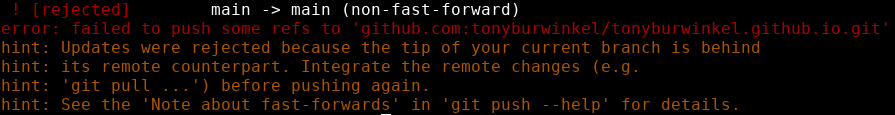

# Git pull
---

Now that my local branch has fallen behind its remote tracking branch, I have a problem.

If I run `git push` again, Git tells me it can't do it:



Git won't let me push my local branch to the origin because it is behind it by one commit.

This is a common issue you will run into when using Git to collaborate. 
Since many software developers all work to update the integration branch at once, your local copy of main can fall behind.

Luckily, there is an easy solution to this...
We can resynchronize with a branch that's ahead of ours by using ```git pull <branch-name>```

```bash
git pull origin main
```


If we check the log, we see that origin/main and main point to the same commit now.

This means our branch is in sync with its remote!
 
> Using git pull before starting to work on your local branch is a good idea.
> 
> If you're working on a big team, you should pull often.
{: .pro-tip}

> ## Exercise
> - [ ] try to push to your remote repository and see what happens
> - [ ] use `git pull` to resynchronize your remote and local repo
> - [ ] check the output of `git log`
{: .exercise}