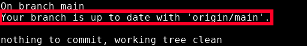
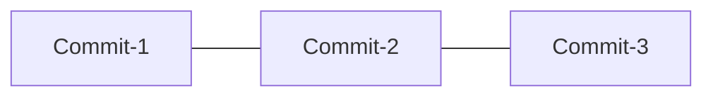
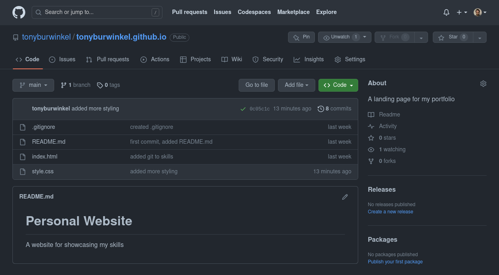
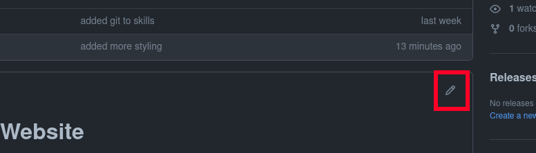
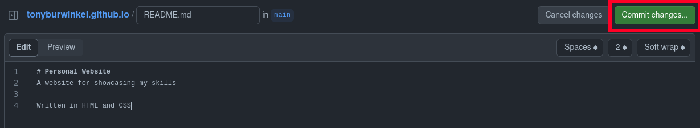
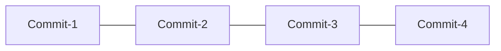

# Remote Repositories

---

Now that we have a remote repo set up, I'll run `git status` again.



A few things to note about this message.
* If your branch has remote tracking, ```git status``` will tell you about it
* Your main branch is a separate branch from origin/main
* The name "origin/main" means that this branch is the tracking branch for your local "main"
* To synchronize your local main branch with its remote, origin main, you use ```git push```

### My local branch
main:


### The copy on GitHub
origin/main:


We can also look at our remote branch on GitHub:



If we were collaborating with other developers, everyone would be making changes to the main branch. I'm going to simulate this by changing my remote branch.

GitHub makes this easy. You can actually edit your repo on GitHub if you want. Normally we would prefer to do this in a text editor like VSCode, but for small tweaks editing on GitHub can be convenient. 

I'll just make a small change to README by clicking the pencil icon in the top right corner of its border box:


---

Then I'll commit those changes.


What's the consequence of this?
* My local branch won't know about these changes to the remote.
* Now the remote branch is __ahead__ of my local branch. 
* By ahead, we mean one branch has more commits than the other.

Here's what our local and remote main branches look like:

### My local branch
main:


### The copy on GitHub
origin/main:


> ## Exercise
> - [ ] Go to your remote repository page on GitHub using your browser
> - [ ] Make an edit to your README.md file
> - [ ] Commit the changes you made on GitHub
{: .exercise}
