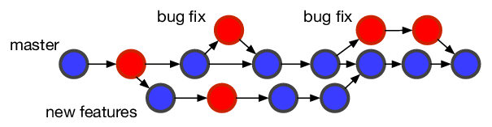

# Branching and Merging
---

{: .text-center}

This section will cover branching and merging with Git. This is probably Git's most important and useful feature. 

Branching and merging takes the stress out of making big changes to our codebase.

If we learn to incorporate branching and merging into our workflow, it will make developing software much more enjoyable. 

# Workshop goals
- [x] learn what Git is and why we should use it
- [x] learn the basic Git commands
- [ ] learn branching and merging with Git
- [ ] learn remote repositories with GitHub
- [ ] learn collaboration with GitHub
