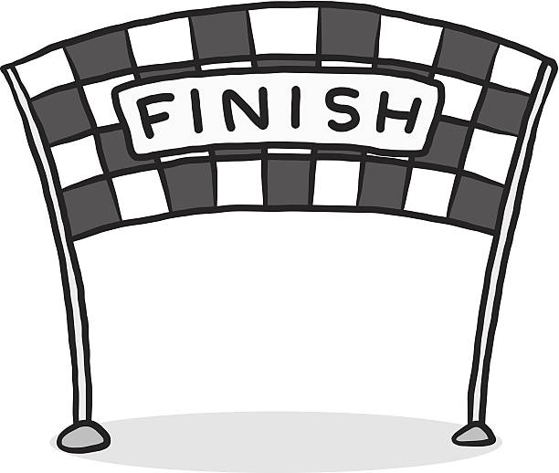

# Conclusion
---

{: .text-center}

A quick recap of the material we covered today:
* adding to the staging area with `git add`
* committing to the repository with `git commit`
* viewing repository info with `git status` and `git log` 
* creating new branches with `git branch` 
* switching branches with `git switch`
* going back to earlier commits with `git checkout`
* viewing differences between branches with `git diff`
* merging branches and resolving conflicts with `git merge`
* setting up a remote repository on GitHub
* pushing to a remote tracking branch with `git push`
* pulling from a remote tracking branch with `git pull`

---

# Workshop goals
- [x] learn what Git is and why we should use it
- [x] learn the basic Git commands
- [x] learn branching and merging with Git
- [x] learn remote repositories with GitHub
- [x] learn collaboration with GitHub

---

## Additional Resources:
* [git kraken cheat sheet](../images/gitkraken-git-basics-cheat-sheet.pdf)
* [interactive visual git branching tutorial](https://learngitbranching.js.org/?locale=en_US)
* [free git book](https://git-scm.com/book/en/v2)
* [official git documentation](https://git-scm.com/doc)

